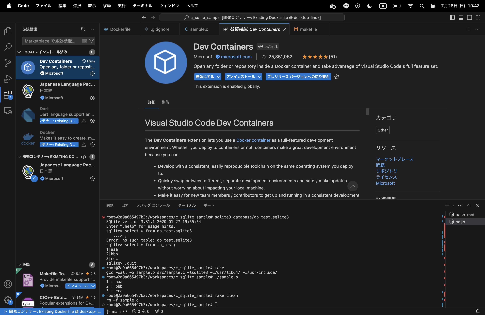
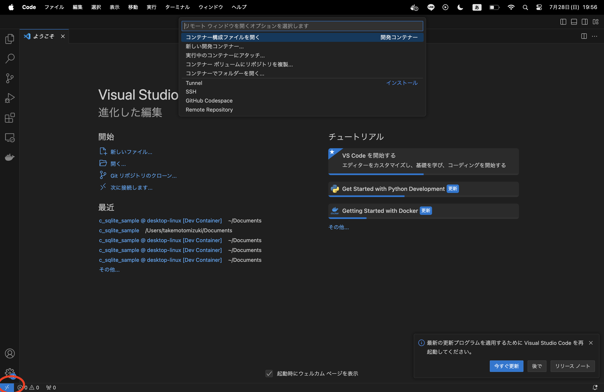
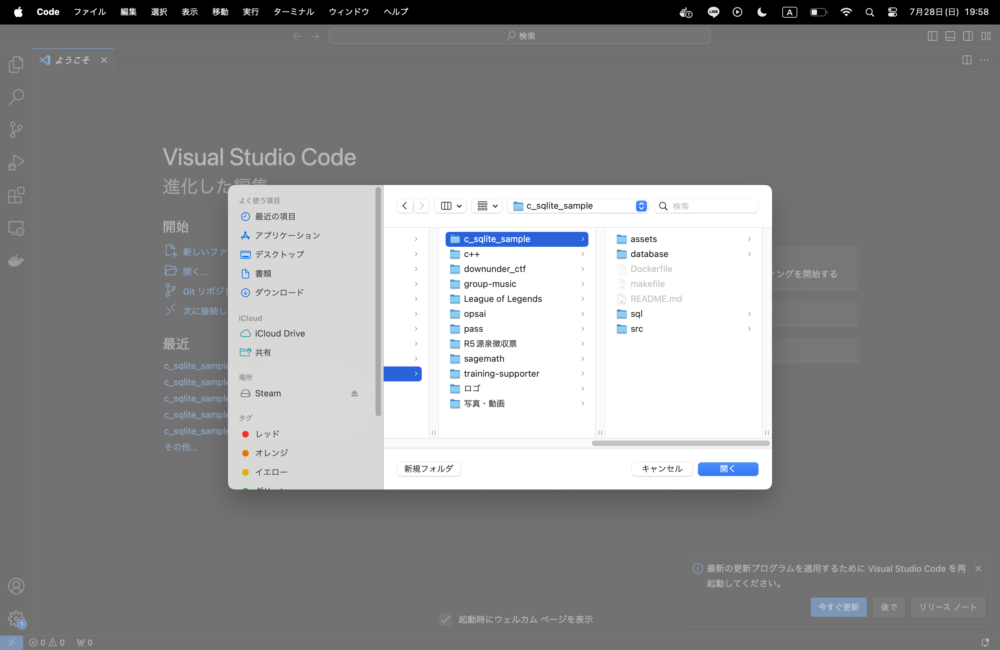

# Docker環境を使う

この環境はC言語とslite3でC言語からDBを操作する演習を行うことができます。 \
Dockerを起動するだけで実行環境を整えることができます。 \
以下、手順です。

## Docker Desktopのインストール

[Docker Desktopの公式サイト](https://www.docker.com/ja-jp/products/docker-desktop/)からアプリをインストールする。

## VSCodeにDev Containersをインストールする



## 開く

左下の><ボタンを押し、コンテナーでフォルダを開くを選択

このリポジトリのファイルを選択し、開く


# sqliteについて

sqliteの対話モードを始める方法

```
cd database
sqlite3 データベース名
```

ここでsqlによるデータの追加や削除ができる。 \
cdしなくても実行自体はできるがファイルが生成される場所がカレントディレクトリになるので注意。